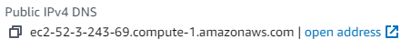

**HOW TO USE**

1.  Hosting Database/API Endpoints:
    1.  Included within the deliverables are all required files for the API and database.
    2.  Using AWS EC2:
        1.  Create EC2 Instance using Amazon Linux Image, desired Key Pair and Security Group
        2.  NOTE: If planning to host the web application online, EC2 instance must be configured to use SSL/TLS
            1.  <https://docs.aws.amazon.com/cloudhsm/latest/userguide/third-offload-linux-openssl.html>
            2.  Flutter web is heavily in Beta, and as such, local running is advised/preferred for performance, alleviating the necessity for SSL/TLS on the EC2 instance
        3.  Connect to EC2 Instance via preferred method, and upload Database/API files
        4.  DO WE CREATE A REQUIREMENTS.TXT? IF SO, INCLUDE NODE, TMUX, ALL MONGO RELATED LIBS, ETC.
        5.  Create a new TMUX instance using the following command:
            1.  \$ tmux new -s api
            2.  Ctrl + b
            3.  d
            4.  $ tmux ls \# This is LS, not iS
                1.  The above command should show the newly created “api” tmux instance
        6.  Connect to the “api” tmux instance via: \$ tmux a -t api
        7.  Change to the “team-united-airlines-airport-operations-api-main” directory
        8.  Enter the following command:
        9.  \$ node ./index.js
        10. Ctrl + b -\> d to exit the TMUX instance
        11. The API is now actively running
        12. To update the API endpoint URL in the flutter code:
            1.  Open the project file “database.dart” in any editor
            2.  Change the baseURL variable on line 10 to be your EC2 instance’s public IPv4 DNS with ‘/api/’ appended to the end 
            
            3.  Your baseURL should look something like: ‘http:// ec2-52-3-243-69.compute-1.amazonaws.com/api/’
2.  Installation options:
    1.  Android
        1.  Run the file “build_android.bat”
        2.  The .apk file will be located under /build/app/outputs/flutter-apk/app-release.apk
    2.  iOS
        1.  <https://docs.flutter.dev/deployment/ios>
        2.  Follow flutter documentation for installation/hosting on app store
    3.  Web
        1.  Flutter Web is still in Beta, and due to this, Flutter web apps perform somewhat poorly when hosted. With this being the case, web hosting is still possible, but running the app locally will perform far better.
        2.  If running locally, flutter must be installed from <https://docs.flutter.dev/get-started/install>
        3.  To run locally:
            1.  Run the provided file, web_app.bat
            2.  If prompted, press the number corresponding to the desired browser
        4.  If desired, the web application may be hosted through github pages, AWS S3 buckets, or another comparable host, but the application must run via an HTTPS page for the camera functionalities to work. As a result, the API must be hosted via an HTTPS endpoint, and all of the requests from within the application must also be converted to be HTTPS requests.
            1.  For setting up an EC2 instance using SSL/TLS, consult the following tutorial:
                1.  <https://docs.aws.amazon.com/cloudhsm/latest/userguide/third-offload-linux-openssl.html>
    4.  Windows:
        1.  Run “build_windows.bat” to generate windows files, program can be safely exited once it has run once
        2.  Program files can be found in /build/windows/runner/Debug
        3.  To distribute the windows application, ensure that the “data” folder as well as all other files in the Debug directory are distributed alongside the airportops_frontend.exe application
        4.  Note: Debug version is used instead of release due to Flutter bugs, Release builds of windows will typically run one time and then be unable to be re-opened due to a bug in Flutter. The debug build is essentially the same as release, with some additional error handling.
